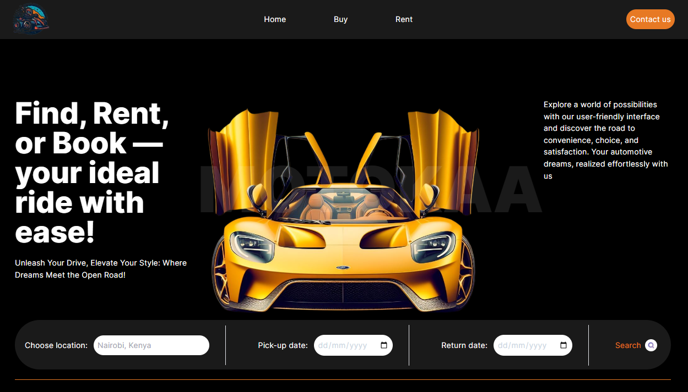

##MOTOKAA— Auto elegance with Next.js v14

##Overview

Welcome to <b>MOTOKAA</b>, a web application built with Next.js v14, using app routes and Tailwind CSS. This platform provides users with the ability to explore, rent, buy, or sell cars. The application integrates with the Imagin Studio API for rich car images and the CarsByAppNinja API for comprehensive car data.

##Features

Home Page:

Engaging landing page with a featured car section.
Quick navigation to different sections of the platform.

Car Listings:

Browse a diverse range of cars available for rent, purchase, or sale.
Filter and search options for easy navigation.

Car Details:

Detailed information about each car, including specifications, pricing, and images.

Seamless process to rent or buy a car directly through the platform.

##Technologies Used
1. Next.js v14:

Harness the power of the latest Next.js version for optimized performance and improved developer experience.

2. Tailwind CSS:

Utilize a utility-first CSS framework for styling, ensuring a clean and responsive design.

3. Imagin Studio API:

Integrate high-quality car images from Imagin Studio to enhance the visual appeal of the listings.

4. CarsByAppNinja API:

Access comprehensive car data, including specifications, model, and more, from the Cars by API-Ninjas API.

##License

This project is licensed under the MIT License.

##Acknowledgments

Thanks to Imagin Studio and CarsByAppNinja for providing APIs that enhance the functionality and content of this car marketplace.
Happy car shopping and selling! 🚗💨